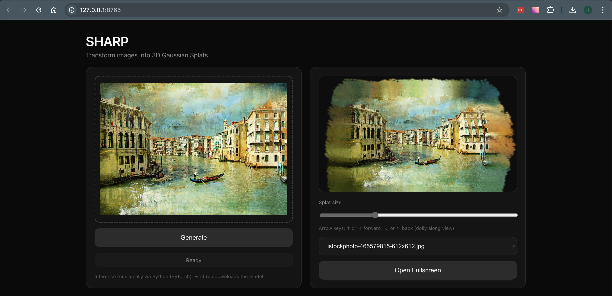
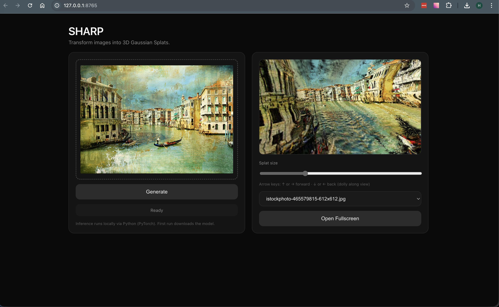

# Sharp local (SHARP web experiment)

Small local app: upload an image → run [Apple SHARP](https://github.com/apple/ml-sharp) (PyTorch) → view the 3D Gaussian splat in the browser with Three.js and [GaussianSplats3D](https://github.com/mkkellogg/GaussianSplats3D).

Inference is **not** in the browser; only the UI and viewer are.

## Screenshots

**Preview 1**



**Preview 2**



## Upstream: `ml-sharp` (git submodule)

Apple’s inference code is **[ml-sharp](https://github.com/apple/ml-sharp)**, vendored as a **git submodule** at `./ml-sharp` (pinned to the commit recorded in this repo).

Clone **with submodules**:

```bash
git clone --recurse-submodules https://github.com/hkirsman/sharp-local.git
cd sharp-local
```

If you already cloned **without** submodules:

```bash
git submodule update --init ml-sharp
```

`./bootstrap.sh` always runs `git submodule update --init ml-sharp` so the checkout matches the **pinned** commit recorded in this repo (cheap no-op when already in sync).

Avoid `git submodule update --init --depth 1 ml-sharp` unless you know that pinned commit is reachable from the remote’s default tip—a shallow fetch can omit older pins and fail checkout.

## Setup (macOS / Homebrew Python)

Use a virtual environment (PEP 668 blocks global `pip`). From the repo root:

```bash
./bootstrap.sh
```

You need **git** on your `PATH` so the submodule can be initialized.

Manual equivalent (submodule already checked out):

```bash
python3 -m venv .venv
source .venv/bin/activate
python3 -m pip install -U pip
python3 -m pip install -e ./ml-sharp -r requirements.txt
```

## Run

From the directory that contains `app.py`:

```bash
source .venv/bin/activate
python app.py
```

Open **http://127.0.0.1:8765**

The first run downloads the SHARP checkpoint (~2.6 GB) into `~/.cache/torch/hub/checkpoints/`.

### Batch folder tool (`sharp_local_batch`)

**GUI:** uses **PySide6-Essentials** (Qt widgets only; smaller than the full `PySide6` metapackage that also downloads Addons). Falls back to **Tk** if it is missing. **CLI** needs no GUI toolkit.

```bash
source .venv/bin/activate
python -m sharp_local_batch
python -m sharp_local_batch --cli --folder /path/to/photos --recursive
# PLY under another tree (under ~: path from home, e.g. Pictures/…; else relative to --folder):
python -m sharp_local_batch --cli --folder /path/to/photos --recursive \
  --output-root /path/to/splat_mirror
# macOS system library (PLY must not be written inside the bundle — mirror required):
python -m sharp_local_batch --cli --folder ~/Pictures/Photos\ Library.photoslibrary \
  --recursive --output-root /path/to/splat_mirror
```

### Optional splat count reduction dependency (`splat-transform`)

Optional splat count reduction (`--limit-splats`) uses the external PlayCanvas CLI `splat-transform`, which is not bundled. Install Node.js/npm from <https://nodejs.org/>, then:

```bash
npm install -g @playcanvas/splat-transform
splat-transform --help
```

On **macOS**, the GUI can enable **Use system Photos library as source folder** — that **replaces** the main folder path (one source per run, not an extra directory); scan/watch use **`~/Pictures/Photos Library.photoslibrary`** while it is on, with mirrored PLY output; pick a **target folder for mirror** outside that bundle. Uncheck it to browse any other folder. Images are collected from **`originals/`** (or older libraries **`Masters/`**) inside the package, same as **`backend/api.py`** iCloud discovery — not only the bundle root. For the CLI, any **`.photoslibrary`** path passed to **`--folder`** requires **`--output-root`** and uses the same rules.

In the GUI, enable **Mirror PLY output** and pick a **target folder for mirror** (must differ from the source folder). Default remains **next to each image**. For images under your home folder, mirrored PLY paths repeat from home (e.g. **`Pictures/Photos Library.photoslibrary/originals/…`**) instead of only **`originals/…`**; sources outside home still mirror relative to the chosen source root.

**Homebrew Python without `_tkinter`:** use **PySide6-Essentials** from requirements; or `brew install python-tk@3.14` (match your Python minor) and recreate `.venv`; or use `--cli`.

**Standalone build (PyInstaller):** with the repo venv active and `ml-sharp` present, run `pip install pyinstaller` then `pyinstaller packaging/sharp_batch.spec` from the repo root. The bundle is **`dist/SharpBatch/`** (large: PyTorch + Qt). Run `./dist/SharpBatch/SharpBatch` (add `--cli …` for headless). First inference still downloads the SHARP weights into the user cache unless you ship them separately.

## Using the UI

1. Drop an image (or browse). HEIC is supported if `pillow-heif` is installed (comes with ml-sharp).
2. **Generate** — wait for inference (MPS/CUDA/CPU depending on your machine).
3. Orbit with the mouse; **arrow keys** move along the view (↑/→ forward, ↓/← back); **Splat size** slider adjusts screen-space scale; **Previous scenes** reloads saved scenes from `outputs/` (each run writes `splat.ply` for the web viewer and, when conversion succeeds, a compressed `splat.spz` for tools that use the [SPZ](https://github.com/nianticlabs/spz) format).

## References

- [ml-sharp](https://github.com/apple/ml-sharp) · [paper](https://arxiv.org/abs/2512.10685)

## Credits

- **UI / idea:** The two-panel layout (upload + preview, generate, local run) and overall workflow were inspired by [**Rob de Winter**](https://www.youtube.com/watch?v=8S57bfQ9w9A)’s walkthrough (“Apple SHARP + custom Three.js interface” on YouTube). This repository is independent community work—not affiliated with Apple, ml-sharp’s authors, or the video creator.
- **3D Gaussian splat preview (browser):** [GaussianSplats3D](https://github.com/mkkellogg/GaussianSplats3D) by Mark Kellogg, consumed as [`@mkkellogg/gaussian-splats-3d@0.4.6`](https://unpkg.com/@mkkellogg/gaussian-splats-3d@0.4.6/) from the [unpkg](https://unpkg.com/) CDN (imported in `static/main.js`). npm listing: [`@mkkellogg/gaussian-splats-3d`](https://www.npmjs.com/package/@mkkellogg/gaussian-splats-3d). See the upstream [license](https://github.com/mkkellogg/GaussianSplats3D/blob/main/LICENSE).
- **WebGL / math (browser):** [Three.js](https://threejs.org/) **r170** (npm `three@0.170.0`) as an ES module, loaded via an import map from unpkg in `static/index.html` (unpkg URLs use that semver, not `three@r170`).
- **Monocular splats (local inference):** [Apple ml-sharp](https://github.com/apple/ml-sharp) and its model weights; use is subject to their [LICENSE](https://github.com/apple/ml-sharp/blob/main/LICENSE) and [LICENSE_MODEL](https://github.com/apple/ml-sharp/blob/main/LICENSE_MODEL).
- **SPZ export (optional sibling file):** [GaussForge](https://github.com/3dgscloud/GaussForge) converts vertex-only PLY to [Niantic SPZ](https://github.com/nianticlabs/spz) (`pip` package `gaussforge`); the in-browser viewer still uses `.ply`.

Third-party scripts are fetched from **unpkg** at runtime in development-style setups; for stricter deployments, vendor these files or use your own CDN and integrity checks.
